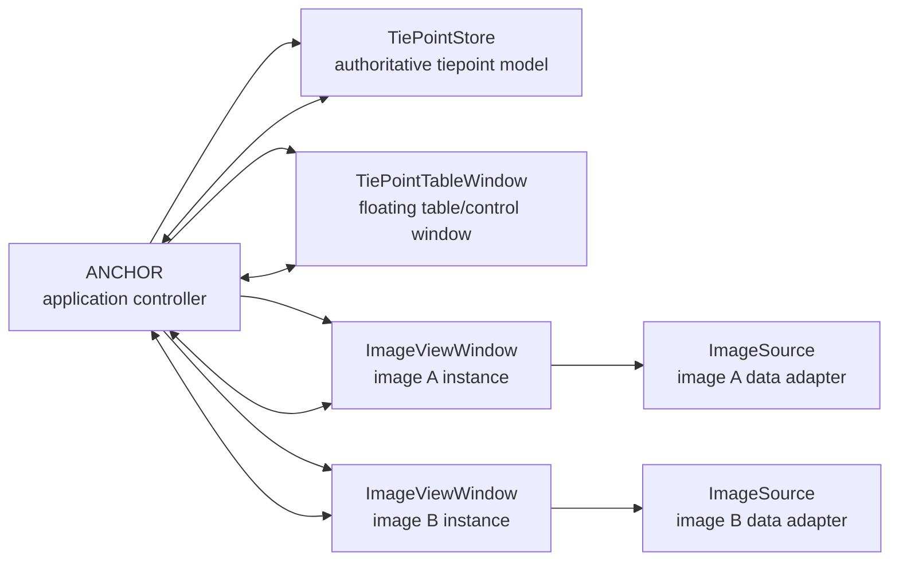

# ANCHOR Design Document

## Project Goal

Build ANCHOR, a MATLAB tool for manually selecting tiepoints between two large, single-channel remote sensing images.

ANCHOR is the application name. The working expansion is **Aligned Navigation and Correspondence Helper for Orthorectification and Registration**. The name is meant to emphasize that manually selected points act as anchors between two image coordinate systems.

The interface should use separate floating windows rather than one monolithic app window:

- One tiepoint manager window with a table of created tiepoints.
- One image display window for image A.
- One image display window for image B.

The two image display windows should be separate instances of the same class. Shared behavior belongs in that class; image-specific state is supplied through constructor arguments or configuration objects.

## Current Assumptions

- MATLAB is available locally at `/Applications/MATLAB_R2026a.app/bin/matlab`.
- The first implementation will target single-channel images.
- Tiepoints are selected manually by the user.
- Images may be too large to display naively at full resolution.
- The first project phase should favor a clean architecture over a fully optimized image backend.
- Geospatial metadata may matter later, but the first coordinate contract should be image pixel coordinates.

## First-Phase Non-Goals

- Automatic feature matching.
- Image registration transform fitting.
- Multispectral or RGB display.
- Full remote sensing metadata handling.
- Production-grade tiled rendering for every image format.

These are important future directions, but the first phase should prove the window model, tiepoint data model, and manual picking workflow.

## Design Principles

- Keep each floating window independent at the UI level, coordinated by a small application controller.
- Store tiepoint data in one authoritative model, not duplicated inside each window.
- Keep image display, tiepoint storage, session persistence, and workflow coordination in separate classes.
- Treat image windows symmetrically; any left/right or fixed/moving distinction should be configuration, not different code paths.
- Store all tiepoint coordinates in full-resolution intrinsic image coordinates, even when the displayed image is decimated or tiled.
- Make future controls easy to add without rewriting the core data model.

## High-Level Architecture



The controller owns the session and wires callbacks between windows. Windows emit user-intent events such as "point picked", "row selected", or "delete requested"; the controller updates the model and asks each window to refresh.

The table window should feel like the main control surface, but it should not own the application. The controller owns all windows so closing one window can be handled deliberately instead of accidentally deleting shared state.

## Proposed MATLAB Package Structure

```text
anchor/
  docs/
    design.md
  src/
    +anchor/
      ANCHOR.m
      TiePointStore.m
      TiePoint.m
      ImageSource.m
      MatrixImageSource.m
      ImageViewWindow.m
      TiePointTableWindow.m
      ViewportState.m
      SessionSerializer.m
```

This package-style layout keeps public class names scoped under `anchor.*`, for example `anchor.ANCHOR`.

## Core Classes

### `ANCHOR`

Top-level coordinator. This class should be small and should not directly contain detailed UI layout code.

Responsibilities:

- Construct the shared `TiePointStore`.
- Load or receive the two image sources.
- Construct the two `ImageViewWindow` instances.
- Construct the `TiePointTableWindow`.
- Coordinate selection state across all windows.
- Route user actions to model updates.
- Save and load sessions through `SessionSerializer`.
- Manage clean shutdown of all floating windows.

Possible construction API:

```matlab
app = anchor.ANCHOR(imageA, imageB);
```

where `imageA` and `imageB` can initially be numeric matrices, then later file paths or richer image source objects.

### `TiePointStore`

Authoritative tiepoint collection and selection model.

Responsibilities:

- Create, update, delete, reorder, and enable/disable tiepoints.
- Track the active tiepoint id.
- Validate tiepoint completeness.
- Expose table-friendly data for `uitable`.
- Notify listeners when tiepoints or selection change.

Likely stored fields per tiepoint:

| Field | Meaning |
| --- | --- |
| `Id` | Stable tiepoint identifier |
| `ImageAPoint` | `[x y]` full-resolution intrinsic pixel coordinate |
| `ImageBPoint` | `[x y]` full-resolution intrinsic pixel coordinate |
| `IsComplete` | True when both image coordinates are present |
| `IsEnabled` | Whether the tiepoint participates in future fitting/export |
| `Label` | Optional user label |
| `Notes` | Optional free text |
| `CreatedAt` | Timestamp |
| `UpdatedAt` | Timestamp |

### `TiePoint`

Small value-like class or struct representing one tiepoint record.

Initial preference: use a MATLAB class only if validation and methods are useful. Otherwise, a table-backed representation inside `TiePointStore` may be simpler and easier to bind to `uitable`.

### `TiePointTableWindow`

Floating table/control window.

Responsibilities:

- Show tiepoints in a table-like format.
- Show complete/incomplete state.
- Allow row selection.
- Provide basic actions such as add, delete, enable/disable, save, load, and export.
- Delegate model changes to the controller rather than directly mutating image windows.

Initial table columns:

| Column | Editable | Notes |
| --- | --- | --- |
| `Id` | No | Stable id |
| `A_X` | Maybe | Full-resolution x coordinate in image A |
| `A_Y` | Maybe | Full-resolution y coordinate in image A |
| `B_X` | Maybe | Full-resolution x coordinate in image B |
| `B_Y` | Maybe | Full-resolution y coordinate in image B |
| `Enabled` | Yes | Include/exclude point |
| `Status` | No | Complete/incomplete |
| `Notes` | Yes | Optional comments |

### `ImageViewWindow`

Reusable floating image display window. There should be two instances of this class, one for each image.

Responsibilities:

- Display a single-channel image using grayscale rendering.
- Maintain view state: pan, zoom, displayed level, contrast limits, and active tool mode.
- Convert between screen/display coordinates and full-resolution image coordinates.
- Draw tiepoint markers for this image.
- Highlight the active tiepoint.
- Emit point-pick, marker-select, marker-move, and viewport-change events.
- Avoid knowing whether the paired image has a corresponding point.
- Keep all rendering state local to the window unless the controller explicitly links it to the other image window.

Constructor configuration should include:

| Setting | Example |
| --- | --- |
| `ImageRole` | `"A"` or `"B"` |
| `WindowTitle` | `"Image A"` |
| `ImageSource` | `MatrixImageSource`, future `BlockedImageSource`, etc. |
| `InitialPosition` | Window rectangle |

### `ImageSource`

Abstract image data adapter. This is the main protection against large-image complexity leaking into the UI.

Responsibilities:

- Report image size and data type.
- Provide display-ready image regions at requested resolution.
- Provide intensity statistics or suggested contrast limits.
- Map display samples back to full-resolution coordinates.

Initial concrete implementation:

- `MatrixImageSource`: wraps an in-memory 2D numeric matrix.

Future implementations:

- `FileImageSource`: lazy load from common image files.
- `GeoTiffImageSource`: preserve geospatial metadata.
- `BlockedImageSource`: read large imagery by tile/pyramid level when Image Processing Toolbox support is available.

### `ViewportState`

Small state object for image window navigation.

Responsibilities:

- Current full-resolution world limits.
- Current zoom scale or pyramid level.
- Contrast limits.
- Optional linked-view settings.

### `SessionSerializer`

Reads and writes project state.

Responsibilities:

- Save image references, tiepoints, active selection, and display settings.
- Load saved sessions.
- Export tiepoints to MATLAB table, CSV, or MAT.

Potential first save format:

- `.mat` session file containing a struct with versioned fields.
- CSV export for interoperability.

## Coordinate Model

Tiepoints should be stored as intrinsic image coordinates:

- `x` increases to the right.
- `y` increases downward.
- Coordinate `[1, 1]` refers to the center of the first pixel, matching MATLAB image intrinsic coordinate conventions.
- Display decimation, pyramid levels, pan, and zoom must not change stored coordinates.

This keeps manual picks stable even if the rendering backend changes.

## Expected User Workflow

Initial workflow proposal:

1. User opens image A and image B.
2. App launches three floating windows: table, image A, image B.
3. User creates a new tiepoint from the table window or by entering pick mode.
4. User clicks a location in image A.
5. User clicks the corresponding location in image B.
6. The table row becomes complete.
7. Selecting a table row highlights the corresponding markers in both image windows.
8. User can edit, delete, disable, or annotate the tiepoint.
9. User saves the session or exports the tiepoint table.

The exact manual controls are intentionally left open for feedback.

## Initial Image Window Controls

Controls to consider for the first implementation:

- Pan.
- Zoom in/out.
- Fit image to window.
- 1:1 pixel view.
- Contrast stretch controls.
- Pick current tiepoint.
- Move existing marker.
- Delete selected marker from this image or delete whole tiepoint.
- Crosshair cursor/readout.
- Optional synchronized zoom/pan between image windows.

These controls should live in the image windows, while dataset-level actions should live in the table/control window.

## Large Image Display Strategy

The display layer should be designed around regions and levels even if the first implementation loads arrays directly.

Recommended staged approach:

1. First pass: support in-memory 2D matrices and ordinary image files.
2. Add decimated overview generation for large arrays.
3. Add region-based rendering so pan/zoom redraws only the visible image region.
4. Add tiled or pyramid-backed sources for very large remote sensing products.
5. Add optional geospatial metadata awareness.

The UI should never assume that the complete image is always available as one display-sized array.

## Event Flow

Important user actions should flow through the controller:

| User action | Origin | Controller response |
| --- | --- | --- |
| Select table row | Table window | Set active tiepoint in store; refresh image highlights |
| Add tiepoint | Table window | Create tiepoint; set active id |
| Pick point | Image window | Update active tiepoint coordinate for that image role |
| Select marker | Image window | Set active tiepoint id |
| Move marker | Image window | Update coordinate in store |
| Delete tiepoint | Table or image window | Remove from store; refresh all windows |
| Change contrast | Image window | Update only that image window's view state |
| Save session | Table window | Serialize image references and tiepoints |

Implementation can start with callback properties on each window class, for example `PointPickedFcn` and `SelectionChangedFcn`. If the app grows, these can be replaced with MATLAB events/listeners without changing the model classes.

## Window Lifecycle

The application should handle window closure explicitly:

- Closing the table window should prompt for unsaved changes once saving exists, then close the image windows.
- Closing one image window should either hide that image window or ask whether to close the session.
- Closing the controller should delete all owned `uifigure` objects.
- Each window class should implement `delete` defensively so repeated cleanup is harmless.

## UI Technology Notes

Use code-based MATLAB UI classes rather than `.mlapp` files:

- `uifigure` for each floating window.
- `uigridlayout` for layout.
- `uitable` for the tiepoint manager.
- `uiaxes` or an equivalent image display component for image rendering.
- Handle classes for windows and controller.

The two image windows should share one implementation class and differ only by injected configuration and image source.

## Testing Strategy

Early tests should focus on non-UI behavior:

- Creating tiepoints.
- Updating image A and image B coordinates.
- Completing/incompleting rows.
- Deleting and selecting tiepoints.
- Converting model data to a table.
- Saving and loading session structs.

UI behavior can be smoke-tested from MATLAB by constructing the app with small synthetic images and verifying that the windows launch.

## Implementation Milestones

### Milestone 1: Static Three-Window Prototype

- Launch table, image A, and image B as separate `uifigure` windows.
- Use two `ImageViewWindow` instances.
- Display synthetic single-channel matrices.
- Render an empty tiepoint table.

### Milestone 2: Tiepoint Model and Table Binding

- Add `TiePointStore`.
- Add, select, delete, and enable/disable tiepoints from the table window.
- Keep table state synchronized with the model.

### Milestone 3: Manual Picking

- Click in each image window to populate the active tiepoint.
- Draw markers in both image windows.
- Highlight the active tiepoint consistently across all windows.

### Milestone 4: Navigation and Contrast

- Add pan, zoom, fit-to-window, and contrast controls.
- Preserve full-resolution coordinates while viewing decimated imagery.

### Milestone 5: Session Persistence

- Save and load sessions.
- Export tiepoints to at least MAT and CSV.

### Milestone 6: Large Image Backend

- Add an image source that avoids full-resolution redraws during navigation.
- Introduce decimated overviews or tiled reads behind the `ImageSource` interface.

## Open Questions

- Should image A/image B be called fixed/moving, reference/secondary, left/right, or something else?
- Should tiepoints be created row-first, click-first, or both?
- Should a tiepoint require exactly one point in each image, or should incomplete tiepoints be allowed indefinitely?
- Should point coordinates be editable directly in the table?
- Should zoom and pan be synchronized between images by default, optional, or absent?
- What contrast controls are required: min/max fields, sliders, histogram stretch, presets, or per-image auto contrast?
- Should points have labels visible in the image windows?
- Should markers be draggable?
- What export formats are required first: MAT, CSV, image registration control point format, or geospatial formats?
- Do we need georeferenced coordinates in addition to pixel coordinates?
- Should closing an image window hide it, reopen it on demand, or close the full session?

## Proposed Next Step

After manual control requirements are clearer, create a minimal class skeleton with:

- `anchor.ANCHOR`
- `anchor.TiePointStore`
- `anchor.ImageViewWindow`
- `anchor.TiePointTableWindow`
- `anchor.MatrixImageSource`

The first runnable milestone should open three floating windows using synthetic images and allow creation, selection, and display of a small set of tiepoints.
