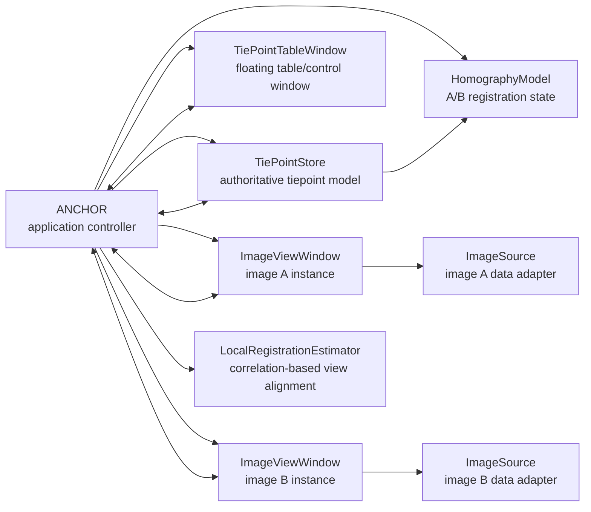

# ANCHOR Design Document

## Project Goal

Build ANCHOR, a MATLAB tool for manually selecting tiepoints between two large, single-channel remote sensing images.

ANCHOR is the application name. The working expansion is **Aligned Navigation and Correspondence Helper for Orthorectification and Registration**. The name is meant to emphasize that manually selected points act as anchors between two image coordinate systems.

The interface should use separate floating windows rather than one monolithic app window:

- One tiepoint manager window with a table of created tiepoints.
- One image display window for image A.
- One image display window for image B.

The two image display windows should be separate instances of the same class. Shared behavior belongs in that class; image-specific state is supplied through constructor arguments or configuration objects.

## Current Assumptions

- MATLAB is available locally at `/Applications/MATLAB_R2026a.app/bin/matlab`.
- The first implementation will target single-channel 8-bit images that are already visually well adjusted.
- Tiepoints are selected manually by the user.
- Tiepoints are complete point pairs by invariant: each tiepoint has one coordinate in image A and one coordinate in image B.
- The initial registration model assumes image A and image B are already aligned.
- ANCHOR tracks an estimated homography between image A and image B, updated as tiepoints are added or edited.
- Images may be too large to display naively at full resolution.
- The first project phase should favor a clean architecture over a fully optimized image backend.
- Geospatial metadata may matter later, but the first coordinate contract should be image pixel coordinates.

## First-Phase Non-Goals

- Automatic feature matching.
- Multispectral or RGB display.
- Full remote sensing metadata handling.
- Production registration QA or final orthorectification output.
- Production-grade tiled rendering for every image format.

These are important future directions, but the first phase should prove the window model, tiepoint data model, and manual picking workflow.

## Design Principles

- Keep each floating window independent at the UI level, coordinated by a small application controller.
- Store tiepoint data in one authoritative model, not duplicated inside each window.
- Keep image display, tiepoint storage, session persistence, and workflow coordination in separate classes.
- Treat image windows symmetrically; any left/right or fixed/moving distinction should be configuration, not different code paths.
- Store all tiepoint coordinates in full-resolution intrinsic image coordinates, even when the displayed image is decimated or tiled.
- Keep current view state queryable from each image window so the controller can align, compare, or transfer views.
- Treat keyboard and mouse interactions as application commands routed through the controller.
- Make future controls easy to add without rewriting the core data model.

## High-Level Architecture



The controller owns the session and wires callbacks between windows. Windows emit user-intent events such as "centered point requested", "row selected", "marker moved", or "delete requested"; the controller updates the model and asks each window to refresh.

The table window should feel like the main control surface, but it should not own the application. The controller owns all windows so closing one window can be handled deliberately instead of accidentally deleting shared state.

## Proposed MATLAB Package Structure

```text
anchor/
  docs/
    design.md
  src/
    +anchor/
      ANCHOR.m
      TiePointStore.m
      TiePoint.m
      ImageSource.m
      MatrixImageSource.m
      ImageViewWindow.m
      TiePointTableWindow.m
      ViewportState.m
      HomographyModel.m
      LocalRegistrationEstimator.m
      CsvTiePointWriter.m
      SessionSerializer.m
```

This package-style layout keeps public class names scoped under `anchor.*`, for example `anchor.ANCHOR`.

## Core Classes

### `ANCHOR`

Top-level coordinator. This class should be small and should not directly contain detailed UI layout code.

Responsibilities:

- Construct the shared `TiePointStore`.
- Load or receive the two image sources.
- Construct the two `ImageViewWindow` instances.
- Construct the `TiePointTableWindow`.
- Coordinate selection state across all windows.
- Track which image window currently has focus.
- Query and transfer viewport state between image windows.
- Maintain the current image A/image B homography estimate.
- Route user actions to model updates.
- Route keyboard and mouse commands from each window.
- Trigger continuous CSV autosave/export after tiepoint edits.
- Save and load sessions through `SessionSerializer`.
- Manage clean shutdown of all floating windows.

Possible construction API:

```matlab
app = anchor.ANCHOR(imageA, imageB);
app = anchor.ANCHOR(imageA, imageB, csvOutputPath);
```

where `imageA` and `imageB` can initially be numeric matrices, then later file paths or richer image source objects. `csvOutputPath` is optional and configures the continuous tiepoint CSV writer.

### `TiePointStore`

Authoritative tiepoint collection and selection model.

Responsibilities:

- Create, update, delete, reorder, and enable/disable tiepoints.
- Track the active tiepoint id.
- Enforce that every tiepoint has both image A and image B coordinates.
- Expose table-friendly data for `uitable`.
- Notify listeners when tiepoints or selection change.

Likely stored fields per tiepoint:

| Field | Meaning |
| --- | --- |
| `Id` | Stable tiepoint identifier |
| `ImageAPoint` | `[x y]` full-resolution intrinsic pixel coordinate |
| `ImageBPoint` | `[x y]` full-resolution intrinsic pixel coordinate |
| `IsEnabled` | Whether the tiepoint participates in future fitting/export |
| `Notes` | Optional free text |
| `CreatedAt` | Timestamp |
| `UpdatedAt` | Timestamp |

### `TiePoint`

Small value-like class or struct representing one tiepoint record.

Initial preference: use a MATLAB class only if validation and methods are useful. Otherwise, a table-backed representation inside `TiePointStore` may be simpler and easier to bind to `uitable`.

Tiepoints should not have a normal incomplete state. Creating a tiepoint requires both image windows to have valid current view centers. If imported data lacks one side of a pair, the importer should reject the row, repair it explicitly, or load it into a separate validation workflow rather than placing an incomplete point into the main store.

### `TiePointTableWindow`

Floating table/control window.

Responsibilities:

- Show tiepoints in a table-like format.
- Allow row selection.
- Provide basic actions such as add centered tiepoint, delete, enable/disable, save, load, and export.
- Provide view matching actions: set image A view from image B, and set image B view from image A, using the current homography.
- Show current autosave/export target and status once CSV output is implemented.
- Delegate model changes to the controller rather than directly mutating image windows.

Initial table columns:

| Column | Editable | Notes |
| --- | --- | --- |
| `Id` | No | Stable id |
| `A_X` | Yes | Full-resolution x coordinate in image A |
| `A_Y` | Yes | Full-resolution y coordinate in image A |
| `B_X` | Yes | Full-resolution x coordinate in image B |
| `B_Y` | Yes | Full-resolution y coordinate in image B |
| `Enabled` | Yes | Include/exclude point |
| `Notes` | Yes | Optional comments |

### `ImageViewWindow`

Reusable floating image display window. There should be two instances of this class, one for each image.

Responsibilities:

- Display a single-channel image using grayscale rendering.
- Maintain view state: pan, zoom, displayed level, contrast limits, and active tool mode.
- Expose query methods for current viewport, view center, scale, and focus state.
- Accept commands to set viewport state, center on a point, or match another transformed view.
- Convert between screen/display coordinates and full-resolution image coordinates.
- Draw tiepoint markers for this image. Markers should be an `X` with a small circle and no visible text label.
- Highlight the active tiepoint.
- Emit point-pick, marker-select, marker-move, and viewport-change events.
- Emit keyboard command events for app-level shortcuts.
- Support crosshair display as per-window state.
- Render temporary translated overlays of the non-focused image for flicker and transparent comparison modes.
- Avoid knowing whether the paired image has a corresponding point.
- Keep all rendering state local to the window unless the controller explicitly links it to the other image window.

Constructor configuration should include:

| Setting | Example |
| --- | --- |
| `ImageRole` | `"A"` or `"B"` |
| `WindowTitle` | `"Image A"` |
| `ImageSource` | `MatrixImageSource`, future `BlockedImageSource`, etc. |
| `InitialPosition` | Window rectangle |

### `ImageSource`

Abstract image data adapter. This is the main protection against large-image complexity leaking into the UI.

Responsibilities:

- Report image size and data type.
- Report source identifier or filename for CSV output.
- Provide display-ready image regions at requested resolution.
- Provide comparable rendered regions for overlay and correlation workflows.
- Provide intensity statistics or suggested contrast limits.
- Map display samples back to full-resolution coordinates.
- Optionally expose an image-to-map coordinate function handle for future geocoordinate export.

Initial concrete implementation:

- `MatrixImageSource`: wraps an in-memory 2D numeric matrix.

Future implementations:

- `FileImageSource`: lazy load from common image files.
- `GeoTiffImageSource`: preserve geospatial metadata.
- `BlockedImageSource`: read large imagery by tile/pyramid level when Image Processing Toolbox support is available.

### `ViewportState`

Small state object for image window navigation.

Responsibilities:

- Current full-resolution world limits.
- Current view center in full-resolution intrinsic coordinates.
- Current zoom scale or pyramid level.
- Contrast limits.
- Optional linked-view settings.
- Enough information for the controller to transform a visible region through the homography and apply the result to the other image window.

### `HomographyModel`

Registration state between image A and image B.

Responsibilities:

- Store the current image A-to-image B and image B-to-image A transforms.
- Initialize as identity because the first assumption is that the images are already registered.
- Re-estimate the transform from all current tiepoints after point creation, movement, or deletion.
- Provide view transfer helpers used by table-window buttons.
- Provide region mapping helpers used by overlay and local correlation workflows.

The transform fallback rules should be deterministic:

- 0 tiepoints: identity transform.
- 1 tiepoint: constant shift from the image A point to the image B point.
- 2 tiepoints: average shift from the two point-pair deltas.
- 3 tiepoints: estimate an affine transform.
- 4 or more tiepoints: attempt to compute the full projective homography.

If full homography estimation fails because the points are degenerate, ANCHOR should retain the current valid estimate or fall back to average shift.

### `LocalRegistrationEstimator`

Correlation-based view alignment helper used by the `G` key.

Responsibilities:

- Take the focused image window's current `ViewportState`.
- Use the current homography to estimate the corresponding non-focused image region.
- Request comparable image patches from each `ImageSource`.
- Estimate a local translation by phase correlation.
- Return a proposed non-focused viewport with the same scale and a correlation-adjusted center.

This helper must not update tiepoint coordinates. It is a navigation aid only; the user commits a new tiepoint afterward by pressing `Space` if the aligned view looks good.

### `CsvTiePointWriter`

Continuously writes tiepoints to CSV to reduce the chance of losing manual work.

Responsibilities:

- Write the tiepoint table after point creation, point movement, deletion, enable/disable changes, and note edits.
- Use an atomic write pattern: write a temporary file, then replace the target CSV.
- Include all tiepoints, regardless of enabled state.
- Include image source names or filenames.
- Keep the initial schema simple:

```text
fname1, ix1, iy1, fname2, ix2, iy2, enabled
```

where `enabled` is written as `1` for enabled tiepoints and `0` for disabled tiepoints.

Future columns may include map coordinates if either image source exposes an image-to-map function handle.

### `SessionSerializer`

Reads and writes project state.

Responsibilities:

- Save image references, tiepoints, active selection, and display settings.
- Load saved sessions.
- Export tiepoints to MATLAB table, CSV, or MAT.
- Preserve or restore the current homography estimate and per-window view state where useful.

Potential first save format:

- `.mat` session file containing a struct with versioned fields.
- Continuously updated CSV for interoperability and recovery.

## Coordinate Model

Tiepoints should be stored as intrinsic image coordinates:

- `x` increases to the right.
- `y` increases downward.
- Coordinate `[1, 1]` refers to the center of the first pixel, matching MATLAB image intrinsic coordinate conventions.
- Display decimation, pyramid levels, pan, and zoom must not change stored coordinates.

This keeps manual picks stable even if the rendering backend changes.

Every normal tiepoint is a complete pair. A new tiepoint is created from the current center of both image windows, so both image A and image B coordinates are known immediately. Moving a marker updates one side of the pair; deleting a tiepoint removes the whole pair.

## Homography and View Matching

ANCHOR maintains a current transform estimate between image A and image B.

- At startup, the transform is identity because the first working assumption is that the images are registered.
- After tiepoint edits, the controller asks `HomographyModel` to update the estimate from all current tiepoints.
- Table-window buttons should transfer views in both directions:
  - Set image A view to match the current image B view.
  - Set image B view to match the current image A view.
- View transfer should preserve the source window's approximate scale and map the visible center or extent through the current transform.
- Each `ImageViewWindow` must expose its current `ViewportState` and current center point in full-resolution intrinsic coordinates.

When there are too few tiepoints for a full homography, the app should use the deterministic lower-order fallback rules described in `HomographyModel`.

## Expected User Workflow

Initial workflow proposal:

1. User opens image A and image B.
2. App launches three floating windows: table, image A, image B.
3. User navigates both image windows near a corresponding location.
4. User presses `Space` in either image window, or an add button in the tiepoint table window.
5. ANCHOR creates a complete tiepoint using the current center of each image window.
6. The new row is selected in the table and both markers are highlighted.
7. User refines either side by dragging markers, nudging with keys, or using overlay alignment modes.
8. The homography and CSV output update after the edit.
9. User navigates to previous/next tiepoints, matches views, or uses local correlation to find additional points.

The core workflow should make point creation deliberate: view-alignment aids help the user get close, and `Space` commits a new tiepoint from the current view centers.

## Required Interaction Controls

### Table Window Controls

- Add centered tiepoint.
- Delete highlighted tiepoint.
- Enable/disable highlighted tiepoint.
- Save/load session.
- Choose or show CSV output path.
- Set image A view from current image B view using the homography.
- Set image B view from current image A view using the homography.

### Image Window Navigation Controls

- Pan.
- Zoom in/out.
- Fit image to window.
- 1:1 pixel view.
- Crosshair cursor/readout.

These controls live in the image windows, while dataset-level actions live in the table/control window.

### Keyboard Shortcuts

Keyboard shortcuts should work from either image window unless noted otherwise. `Backspace` should also work from the table window when a row is highlighted.

| Key | Behavior |
| --- | --- |
| `F` | Toggle focus between image A and image B only. The table window is excluded from this focus cycle. |
| `W` | Move the highlighted tiepoint marker up in the focused image window. |
| `A` | Move the highlighted tiepoint marker left in the focused image window. |
| `S` | Move the highlighted tiepoint marker down in the focused image window. |
| `D` | Move the highlighted tiepoint marker right in the focused image window. |
| `C` | Toggle crosshairs in the focused image window. |
| `Space` | Create a new complete tiepoint at the current center of both image windows. |
| `Shift` hold | Flicker the non-focused image as a translated overlay in the focused image window, aligned by the highlighted tiepoint. |
| `Left Ctrl` hold | Show the non-focused image as a transparent translated overlay in the focused image window. |
| `+` while holding `Left Ctrl` | Increase transparent overlay opacity. |
| `-` while holding `Left Ctrl` | Decrease transparent overlay opacity. |
| `Q` | Select the previous tiepoint and center both image windows on its coordinates. |
| `E` | Select the next tiepoint and center both image windows on its coordinates. |
| `Backspace` | Delete the currently highlighted tiepoint. |
| `G` | Run local correlation alignment from the focused view and update only the non-focused view. |

The `W/A/S/D` nudge size should start as one image pixel at full resolution. Later versions may add a configurable nudge step.

### Mouse Interactions

| Interaction | Behavior |
| --- | --- |
| Left-click-drag image background | Pan/translate the focused image view. |
| Mouse wheel over image | Zoom in/out around the cursor location. |
| Double left-click image background | Center the clicked image coordinate in the focused image view. |
| Left-click marker | Select the marker's tiepoint and highlight its row in the table. |
| Double left-click marker | Select the tiepoint and center the other image window on the corresponding point. |
| Left-click-drag marker | Move the marker in the focused image window and update only that image coordinate. |
| Right-click-drag while holding `Left Ctrl` | Translate the transparent overlay of the non-focused image. |

Default mouse behavior should feel like a typical image viewer unless overridden by a marker or overlay interaction. Marker movement must update the model through the controller, not directly from the image window.

## Overlay Alignment Modes

ANCHOR has two temporary overlay modes for comparing the focused image with the non-focused image.

### Shift Flicker Overlay

Holding `Shift` in the focused image window should flicker the non-focused image over the focused view.

- Alignment is translation-only.
- The translation is derived from the highlighted tiepoint.
- The active point in the non-focused image is shifted onto the active point in the focused image.
- Releasing `Shift` removes the overlay.
- No tiepoint coordinates are changed.

### Left Ctrl Transparent Overlay

Holding `Left Ctrl` in the focused image window should display the non-focused image transparently over the focused view.

- Initial alignment is translation-only, derived from the highlighted tiepoint.
- Default overlay opacity is 50%.
- Pressing `+` or `-` while holding `Left Ctrl` increases or decreases opacity.
- Right-click-drag translates the overlay interactively.
- The translation is temporary until `Left Ctrl` is released.
- On release, the focused image coordinate remains unchanged.
- On release, the non-focused image coordinate for the highlighted tiepoint is updated to match the manual translation.

This mode needs a temporary overlay transform separate from the committed tiepoint model. The controller commits the resulting coordinate update only when `Left Ctrl` is released.

## Local Correlation Alignment

Pressing `G` should estimate a local translation between the focused image and the non-focused image using phase correlation.

Process:

1. Query the focused image window's current view extent and scale.
2. Use that exact displayed focused-window extent as the patch definition.
3. Use the current homography to estimate the corresponding region in the non-focused image.
4. Render comparable patches from both image sources in memory with the same array size as the focused view.
5. Use phase correlation on the two rendered patches to estimate a local translation.
6. Convert the correlation shift from rendered-patch pixels back through the current view resolution/scale.
7. Update the non-focused image window to the same scale and a correlation-adjusted center.

The focused view fully determines patch size, search area, and resolution. For example, if the focused window is displaying a 512-by-640 patch at 2:1 image-to-screen resolution, the correlation algorithm should receive two 512-by-640 arrays. The returned patch-pixel shift is then converted back to image coordinates before the non-focused view center is updated. There is no independent search-window setting in the first implementation.

This action must not update the highlighted tiepoint or create a new point. If the user likes the aligned views, pressing `Space` creates a new complete tiepoint at the two current view centers.

## Large Image Display Strategy

The display layer should be designed around regions and levels even if the first implementation loads arrays directly.

Recommended staged approach:

1. First pass: support in-memory 2D matrices and ordinary image files.
2. Add decimated overview generation for large arrays.
3. Add region-based rendering so pan/zoom redraws only the visible image region.
4. Add comparable patch extraction for overlays and local correlation.
5. Add tiled or pyramid-backed sources for very large remote sensing products.
6. Add optional geospatial metadata awareness.

The UI should never assume that the complete image is always available as one display-sized array.

## Event Flow

Important user actions should flow through the controller:

| User action | Origin | Controller response |
| --- | --- | --- |
| Select table row | Table window | Set active tiepoint in store; refresh image highlights |
| Add centered tiepoint | Table or image window | Query both view centers; create complete tiepoint; select it; update homography and CSV |
| Select marker | Image window | Set active tiepoint id; highlight table row and both markers |
| Double-click marker | Image window | Select tiepoint; center the other image window on the corresponding coordinate |
| Move marker | Image window | Update one coordinate in store; update homography and CSV |
| Nudge marker | Image window shortcut | Move active coordinate in focused window; update homography and CSV |
| Delete tiepoint | Table or shortcut | Remove whole tiepoint pair; choose next selection; update homography and CSV |
| Edit table coordinate | Table window | Update one coordinate in store; update marker, homography, and CSV |
| Edit enabled/notes field | Table window | Update store and CSV; enabled state is written but homography still uses all points |
| Match A view from B | Table window | Query B viewport; transform through homography; set A viewport |
| Match B view from A | Table window | Query A viewport; transform through homography; set B viewport |
| Toggle focus | Image window shortcut | Bring the other image window forward |
| Toggle crosshair | Image window shortcut | Update focused image window only |
| Previous/next tiepoint | Image window shortcut | Select row; center both image windows on the pair |
| Shift overlay | Image window shortcut | Show temporary flicker overlay; do not update model |
| Left Ctrl overlay drag | Image window shortcut/mouse | Show transparent overlay; commit non-focused coordinate update on release |
| Local correlation alignment | Image window shortcut | Update non-focused viewport only; do not update model |
| Save session | Table window | Serialize image references, tiepoints, homography, and view state |

Implementation can start with callback properties on each window class, for example `CenteredTiePointRequestedFcn`, `MarkerMovedFcn`, and `SelectionChangedFcn`. If the app grows, these can be replaced with MATLAB events/listeners without changing the model classes.

## Window Lifecycle

The application should handle window closure explicitly:

- Closing the table window should close the full app after checking whether the tiepoint CSV has changes since the last successful save.
- If CSV changes are pending, the table window should ask whether to save and close, close without saving, or cancel.
- Closing either image window should close the full app after writing the current CSV.
- Closing the controller should write the current CSV and delete all owned `uifigure` objects.
- Each window class should implement `delete` defensively so repeated cleanup is harmless.

## UI Technology Notes

Use code-based MATLAB UI classes rather than `.mlapp` files:

- `uifigure` for each floating window.
- `uigridlayout` for layout.
- `uitable` for the tiepoint manager.
- `uiaxes` or an equivalent image display component for image rendering.
- Figure-level key callbacks for image window shortcuts.
- Figure/window callbacks for focus tracking.
- Handle classes for windows and controller.

The two image windows should share one implementation class and differ only by injected configuration and image source.

## Testing Strategy

Early tests should focus on non-UI behavior:

- Creating tiepoints.
- Updating image A and image B coordinates.
- Editing coordinates directly in the table.
- Deleting and selecting tiepoints.
- Enforcing complete-pair tiepoint creation.
- Converting model data to a table.
- Updating homography state after tiepoint edits.
- Mapping viewport centers/extents through the homography.
- Writing CSV output with the expected schema, including `enabled` as `1` or `0`.
- Computing local correlation shifts from synthetic translated patches.
- Saving and loading session structs.

UI behavior can be smoke-tested from MATLAB by constructing the app with small synthetic images and verifying that the windows launch.

## Implementation Milestones

### Milestone 1: Static Three-Window Prototype

- Launch table, image A, and image B as separate `uifigure` windows.
- Use two `ImageViewWindow` instances.
- Display synthetic single-channel matrices.
- Render an empty tiepoint table.

### Milestone 2: Tiepoint Model and Table Binding

- Add `TiePointStore`.
- Add centered, select, delete, and enable/disable complete tiepoints from the table window.
- Keep table state synchronized with the model.
- Add continuous CSV writing with the initial `fname1, ix1, iy1, fname2, ix2, iy2, enabled` schema.

### Milestone 3: Manual Picking

- Create tiepoints from the current center of both image windows with `Space`.
- Draw markers in both image windows.
- Highlight the active tiepoint consistently across all windows.
- Support marker click, double-click, drag, delete, and `W/A/S/D` nudging.

### Milestone 4: Homography and View Transfer

- Track current homography state.
- Initialize the homography as identity.
- Update the homography after tiepoint edits.
- Add table-window buttons for image A from image B and image B from image A view matching.
- Make each image window's `ViewportState` queryable and settable.

### Milestone 5: Navigation and Focus

- Add pan, zoom, and fit-to-window controls.
- Preserve full-resolution coordinates while viewing decimated imagery.
- Add image A/image B focus toggling with `F`.
- Add crosshair toggling with `C`.
- Add previous/next tiepoint navigation with `Q` and `E`.

### Milestone 6: Overlay Alignment Modes

- Add `Shift` flicker overlay aligned by active tiepoint translation.
- Add `Left Ctrl` transparent overlay aligned by active tiepoint translation.
- Support right-click-drag overlay translation while holding `Left Ctrl`.
- Commit the adjusted non-focused tiepoint coordinate when `Left Ctrl` is released.

### Milestone 7: Local Correlation Alignment

- Add `LocalRegistrationEstimator`.
- Implement `G` key view alignment using homography initialization plus local correlation.
- Update only the non-focused viewport; do not update tiepoints.

Status: implemented for in-memory matrix image sources using focused-view viewport rendering and FFT phase correlation.

### Milestone 8: Session Persistence

- Save and load sessions.
- Preserve image references, tiepoints, homography state, CSV target, and useful view state.

Status: implemented for in-memory matrix image sources with MAT-file session save/load from the table window.

### Milestone 9: Large Image Backend

- Add an image source that avoids full-resolution redraws during navigation.
- Introduce decimated overviews or tiled reads behind the `ImageSource` interface.

## Resolved Questions

- Phase correlation should use exactly the current focused-window view extent, displayed patch size, and view resolution at the moment `G` is pressed.
- Closing the table window should require confirmation only when the CSV state is dirty since the last successful save.

## Deferred Questions

- Future georeferenced/map coordinate representation in CSV export is deferred until image-to-map functions are introduced.

## Proposed Next Step

Proceed to Milestone 9: add a large-image source abstraction that avoids full-resolution redraws during navigation.
